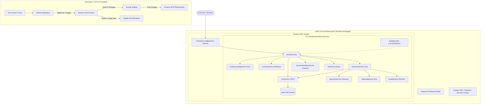

# 🛍️ E-Commerce Microservices Deployment on AWS EKS

An end-to-end production-grade DevOps project demonstrating the deployment, automation, and management of an 11-tier microservices e-commerce application on **Amazon EKS (Elastic Kubernetes Service)** using **Terraform (IaC)**, **Docker**, **Amazon ECR**, and **Jenkins CI/CD**.

---

## 📌 Architecture Overview



---

## 📦 Microservices Catalog

The application is comprised of 11 distinct microservices written in various languages and frameworks, simulating a real-world enterprise polyglot microservice environment:

| Service | Language / Runtime | Description |
| :--- | :--- | :--- |
| **frontend** | Go | Exposes HTTP server to serve the website and orchestrate other services |
| **cartservice** | C# / .NET 7.0 | Stores the items in the user's shopping cart in Redis |
| **productcatalogservice**| Go | Provides product inventory list, details, and search capabilities |
| **currencyservice** | Node.js | Converts cash amounts into other supported global currencies |
| **paymentservice** | Node.js | Processes mock credit card transactions |
| **shippingservice** | Go | Calculates shipping costs and provides tracking IDs |
| **emailservice** | Python | Sends order confirmation emails to users |
| **checkoutservice** | Go | Orchestrates order processing, payment, shipping, and notification |
| **recommendationservice**| Python | Recommends contextual related items based on cart contents |
| **adservice** | Java | Serves targeted advertisement banners |
| **loadgenerator** | Python (Locust) | Continuously generates realistic user traffic on the application |
| **redis-cart** | Redis | High-performance in-memory key-value cache for user shopping carts |

---

## 🗂️ Repository Structure

```text
.
├── ecr-terraform/            # Terraform configurations to provision Amazon ECR repositories
│   ├── backend.tf            # Remote S3 backend configuration for ECR state
│   ├── ecr-jenkinfile        # Jenkins pipeline for ECR Terraform automation
│   └── ecr-repo-main.tf      # ECR repository definitions with image scanning enabled
├── eks-terraform/            # Terraform configurations for AWS EKS Cluster & Node Groups
│   ├── backend.tf            # Remote S3 backend configuration for EKS state
│   ├── eks-jenkinsfile       # Jenkins pipeline to apply/destroy EKS cluster
│   ├── main.tf               # EKS cluster, node groups, IAM roles, and OIDC config
│   └── variable.tf           # Configurable variables for EKS setup
├── jenkinsfiles/             # Declarative Jenkins CI/CD pipelines for all 11 microservices
│   ├── adservice
│   ├── cartservice
│   ├── checkoutservice
│   ├── currencyservice
│   ├── emailservice
│   ├── frontend
│   ├── loadgenerator
│   ├── paymentservice
│   ├── productcatalogservice
│   ├── recommendationservice
│   └── shippingservice
├── kubernetes-files/         # Production Kubernetes YAML manifests (Deployments & Services)
│   ├── adservice.yaml
│   ├── cartservice.yaml
│   ├── checkoutservice.yaml
│   ├── currencyservice.yaml
│   ├── emailservice.yaml
│   ├── frontend.yaml
│   ├── loadgenerator.yaml
│   ├── paymentservice.yaml
│   ├── productcatalogservice.yaml
│   ├── recommendationservice.yaml
│   ├── redis-cart.yaml
│   └── shippingservice.yaml
├── s3-buckets/               # Terraform script to create S3 buckets for remote state locking
│   ├── main.tf
│   ├── outputs.tf
│   └── variables.tf
├── src/                      # Microservices source code and Dockerfiles
│   ├── adservice/
│   ├── cartservice/
│   ├── checkoutservice/
│   ├── currencyservice/
│   ├── emailservice/
│   ├── frontend/
│   ├── loadgenerator/
│   ├── paymentservice/
│   ├── productcatalogservice/
│   ├── recommendationservice/
│   └── shippingservice/
└── terraform_main_ec2/       # Terraform to provision the Jump Host / Jenkins CI/CD EC2 instance
    ├── iam-instance-profile.tf
    ├── iam-policy.tf
    ├── iam-role.tf
    ├── install-tools.sh      # Bootstrap script installing Docker, Jenkins, kubectl, Helm, Trivy, etc.
    ├── jumphost.tf
    ├── kubernetes.sh         # Installs ArgoCD, Prometheus, Grafana, EBS CSI Driver
    ├── outputs.tf
    ├── terraform.tf
    ├── variables.tf
    └── vpc.tf
```

---

## 🛠️ Technology Stack & Tools

* **Cloud Provider:** Amazon Web Services (AWS)
* **Compute / Orchestration:** Amazon EKS, EC2
* **Container Registry:** Amazon ECR
* **Infrastructure as Code (IaC):** Terraform
* **Continuous Integration & Deployment (CI/CD):** Jenkins
* **Containerization:** Docker
* **Security & Quality Scanning:** SonarQube, Trivy
* **Monitoring & GitOps:** Prometheus, Grafana, ArgoCD

---

## 🚀 Deployment Walkthrough

### Step 1: Prerequisites
Ensure you have the following configured locally or on your management machine:
* [AWS CLI v2](https://docs.aws.amazon.com/cli/latest/userguide/install-cliv2.html) installed and authenticated:
  ```bash
  aws configure
  ```
* [Terraform](https://developer.hashicorp.com/terraform/downloads) (`>= 1.6.3`)
* [kubectl](https://kubernetes.io/docs/tasks/tools/)

---

### Step 2: Provision Remote State S3 Buckets
Navigate to the `s3-buckets` directory and create the S3 buckets used to maintain Terraform state files:
```bash
cd s3-buckets
terraform init
terraform plan
terraform apply -auto-approve
cd ..
```

---

### Step 3: Provision Jump Host & Jenkins CI/CD Instance
Navigate to `terraform_main_ec2` to create the VPC and EC2 instance bootstrapped with all essential DevOps utilities (Jenkins, Docker, Trivy, SonarQube, Helm, kubectl):
```bash
cd terraform_main_ec2
terraform init
terraform plan
terraform apply -auto-approve
cd ..
```
* **Jenkins:** Access via `http://<EC2_PUBLIC_IP>:8080` (Retrieve initial admin password from `/var/lib/jenkins/secrets/initialAdminPassword`).
* **SonarQube:** Access via `http://<EC2_PUBLIC_IP>:9000` (`admin` / `admin`).

---

### Step 4: Create Amazon ECR Repositories
Run Terraform to automatically create repositories for all 11 microservices:
```bash
cd ecr-terraform
terraform init
terraform plan
terraform apply -auto-approve
cd ..
```

---

### Step 5: Provision Amazon EKS Cluster
Deploy the managed Kubernetes control plane and worker node group:
```bash
cd eks-terraform
terraform init
terraform plan
terraform apply -auto-approve
cd ..
```

Update your local kubeconfig to interact with the new cluster:
```bash
aws eks update-kubeconfig --region us-east-1 --name project-eks
kubectl get nodes
```

---

### Step 6: Configure Jenkins CI/CD Pipelines
1. In the Jenkins Web UI, configure a secret text credential with ID `my-git-pattoken` containing your GitHub Personal Access Token (PAT).
2. For each microservice in `jenkinsfiles/`, update the environment variables to match your AWS Account ID and GitHub username:
   ```groovy
   environment {
       AWS_ACCOUNT_ID = "<YOUR_AWS_ACCOUNT_ID>"
       AWS_REGION     = "us-east-1"
       GIT_REPO_NAME  = "<YOUR_REPO_NAME>"
       GIT_USER_NAME  = "<YOUR_GITHUB_USERNAME>"
       GIT_EMAIL      = "<YOUR_EMAIL>"
       GIT_BRANCH     = "main"
   }
   ```
3. Create a Jenkins Pipeline item for each service pointing to its corresponding Jenkinsfile in `jenkinsfiles/`.
4. Run the pipeline: Jenkins will build the Docker container, push the image to AWS ECR, and update the Kubernetes deployment manifest automatically.

---

### Step 7: Deploy Applications to Kubernetes
Apply the Kubernetes manifests to deploy all microservices and the frontend load balancer:
```bash
cd kubernetes-files
kubectl apply -f .
```

Verify that all pods, services, and deployments are running:
```bash
kubectl get pods
kubectl get svc
```

To access the online store, find the external IP of the `frontend-external` LoadBalancer service:
```bash
kubectl get svc frontend-external -o jsonpath='{.status.loadBalancer.ingress[0].hostname}'
```
Open the output URL in your browser to view the live e-commerce application.

---

### Step 8: Kubernetes Addons & Observability (Optional)
Run the script on your Jump Host to install ArgoCD, Prometheus, Grafana, and the AWS EBS CSI driver:
```bash
chmod +x terraform_main_ec2/kubernetes.sh
./terraform_main_ec2/kubernetes.sh
```

---

## 🧹 Teardown & Resource Cleanup

To prevent incurring unnecessary AWS charges, destroy the resources in reverse order:

```bash
# 1. Delete Kubernetes resources
kubectl delete -f kubernetes-files/

# 2. Destroy EKS Cluster
cd eks-terraform
terraform destroy -auto-approve
cd ..

# 3. Destroy ECR Repositories
cd ecr-terraform
terraform destroy -auto-approve
cd ..

# 4. Destroy Jump Host EC2 and VPC
cd terraform_main_ec2
terraform destroy -auto-approve
cd ..

# 5. Destroy S3 State Buckets (empty bucket objects first if required)
cd s3-buckets
terraform destroy -auto-approve
cd ..
```

---

## 🔒 Security Best Practices Implemented

* **Container Security:** Runs containers as unprivileged non-root users (`runAsNonRoot: true`, `runAsUser: 1000`) with root filesystems set to read-only where possible and Linux capabilities dropped.
* **IAM Least Privilege:** Dedicated IAM roles for EKS master nodes, worker nodes, and EC2 instances with distinct policy attachments.
* **OIDC Integration:** EKS configured with OpenID Connect provider for fine-grained IAM roles for Service Accounts (IRSA).
* **Automated Security Scanning:** ECR image scanning enabled on push (`scan_on_push = true`) alongside Trivy container vulnerability audits.

---

## 📄 License
This project is open-source and available under the [Apache 2.0 License](LICENSE).
